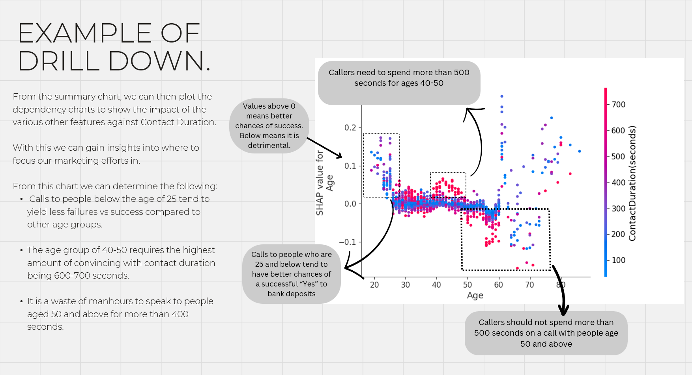

# Marketing Data Project

This dataset contains marketing data from a tech company aimed at converting individuals to purchase financial products. 

The information is collected through various channels and encompasses a range of features that can be utilized for analysis, segmentation, and targeted marketing strategies.

The main steps are as follows:

0. Exploratory Data Analysis
1. Data Cleaning
2. One-hot Encoding
3. Train-Test-Split
4. Model Training
5. Parameter Tuning
6. Coalition game-theory/SHAP library for most important features

## Presentation Viewing

Due to Github's 50mb limit, the presentation was divided into 3 .7z or zip files.

These are to enable it to be uploaded to Github and should be watched in sequential order for explanations.